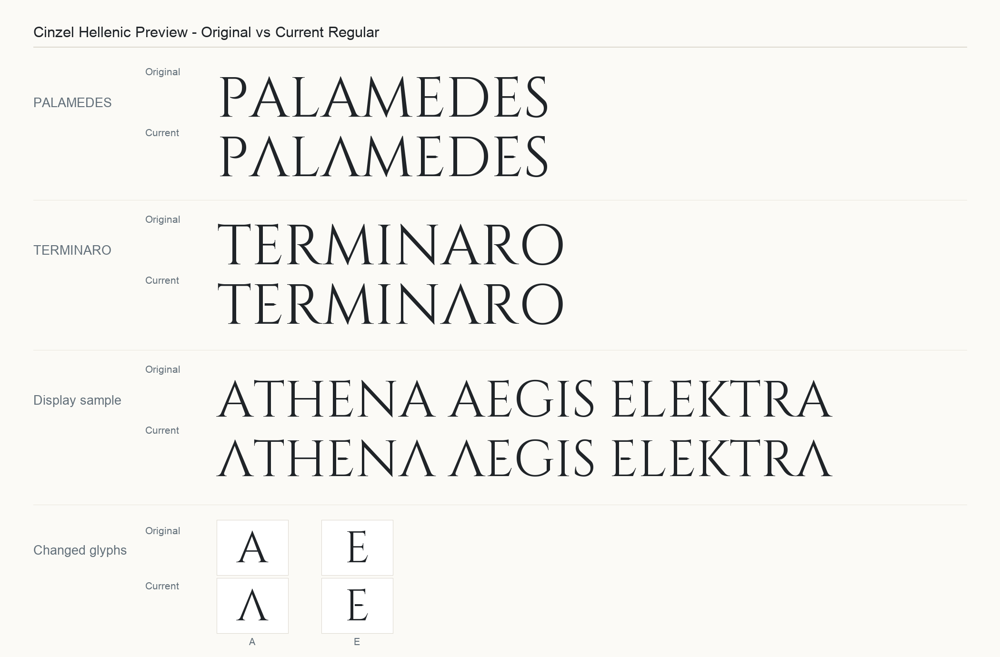
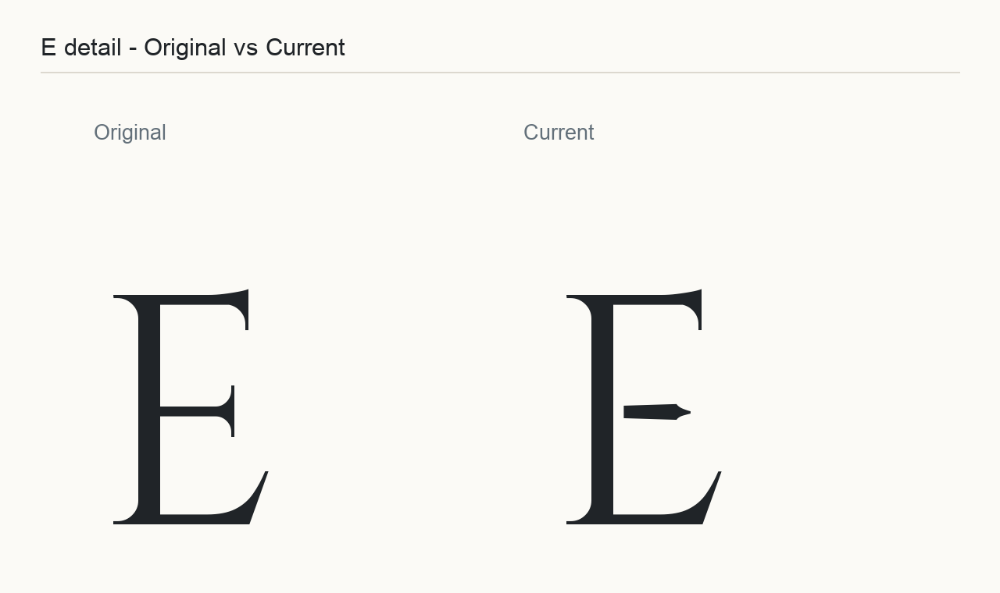
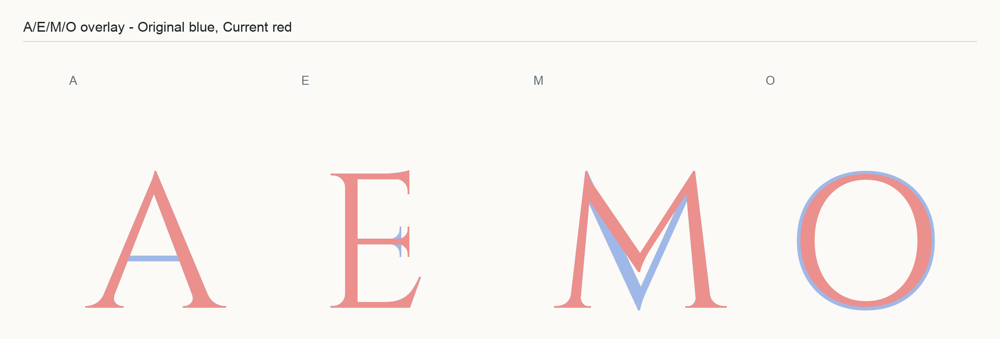

Cinzel Hellenic
===============

Cinzel Hellenic is a Regular-only display typeface derived from [Cinzel](https://github.com/NDISCOVER/Cinzel). It keeps the classical Cinzel base and adds a restrained Hellenic tint for Latin logos, marks, and display use.

The Hellenic treatment is intentionally narrow: the current design focuses on the uppercase `A` and `E`, preserving Latin readability while nudging the word shape toward Greek inscriptional forms.

Preview
-------



### E detail



### A/E overlay



Origin
------

Cinzel Hellenic is a modified version of [Cinzel](https://github.com/NDISCOVER/Cinzel), originally designed by Natanael Gama. The original project remains the canonical source for Cinzel; this repository contains the Hellenic display adaptation.

Authors
-------

- Original Cinzel typeface: Natanael Gama
- Cinzel Hellenic adaptation: Sebastian Werner

License
-------

Cinzel Hellenic is distributed under the SIL Open Font License, Version 1.1. See `OFL.txt`.

The original Cinzel reference font is kept at `fonts/reference/Cinzel-Regular.ttf` only for visual comparison.

Build
-----

Install the build requirements, then run:

```sh
python3 -m pip install -r requirements-build.txt
bash sources/build.sh
```

The build emits:

- `fonts/ttf/CinzelHellenic-Regular.ttf`
- `fonts/woff2/CinzelHellenic-Regular.woff2`

No Bold, Black, Decorative, or variable fonts are built.

Regenerating Previews
---------------------

After building the font, regenerate the checked-in preview images with:

```sh
python3 -m pip install -r requirements-preview.txt
python3 tools/render-previews.py
```

The preview script compares the current built font with the original reference at `fonts/reference/Cinzel-Regular.ttf` and writes:

- `previews/specimen.png`
- `previews/e-detail.png`
- `previews/ae-overlay.png`

For both build and preview tooling in one environment, install `requirements-dev.txt`.

Repository
----------

Source and releases are maintained at:

https://github.com/sebastian-software/cinzel-hellenic
